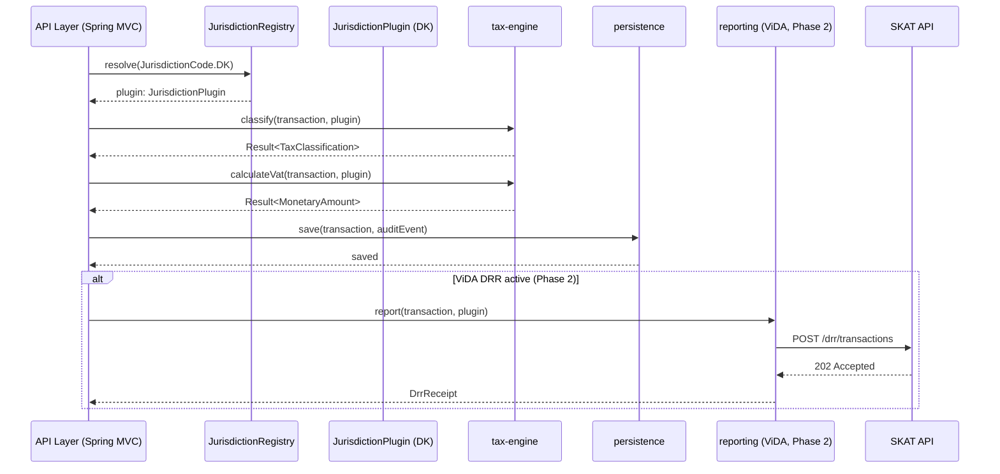

# ADR-003: Jurisdiction Plugin Architecture

## Status
Accepted

## Context
The system must support Danish VAT today (Phase 1) and additional EU jurisdictions in Phase 3 — without
modifying core packages. ViDA obligations (Phase 2) layer additional real-time reporting requirements
on top of base jurisdiction rules, and these must compose cleanly.

The key invariant: **adding a new country must require zero changes to core packages**.

This ADR defines the plugin contract, registration mechanism, resolution strategy, and ViDA composition model.
Implementation language is Java 21 (records, sealed interfaces, pattern matching).

## Decision

### The `JurisdictionPlugin` Interface
Every jurisdiction must implement this interface. It is defined in
`core-domain/src/main/java/com/netcompany/vat/coredomain/jurisdiction/JurisdictionPlugin.java`
and is the single contract that the core system depends on.

```java
public interface JurisdictionPlugin {
    JurisdictionCode getCode();
    long getVatRateInBasisPoints(TaxCode taxCode, LocalDate effectiveDate);
    FilingCadence determineFilingCadence(MonetaryAmount annualTurnover);
    LocalDate calculateFilingDeadline(TaxPeriod period);
    boolean isReverseChargeApplicable(Transaction transaction);
    boolean isVidaEnabled();
    String getAuthorityName();
}
```

### Plugin Registration
Plugins are registered at application startup in the API module via a `JurisdictionRegistry` bean.
The registry is the only place that knows about specific jurisdictions — all other code depends only on the interface.

```java
// Registration (in api module — Spring @Configuration)
@Bean
JurisdictionRegistry jurisdictionRegistry() {
    JurisdictionRegistry registry = new JurisdictionRegistry();
    registry.register(new DkJurisdictionPlugin());
    // registry.register(new NoJurisdictionPlugin());  // Phase 3: Norway
    // registry.register(new DeJurisdictionPlugin());  // Phase 3: Germany
    return registry;
}
```

### Plugin Resolution
At runtime, the correct plugin is resolved by `JurisdictionCode`. All business logic operates
on the `JurisdictionPlugin` interface — never on a concrete implementation.

```java
JurisdictionPlugin plugin = registry.resolve(JurisdictionCode.DK);
long rate = plugin.getVatRateInBasisPoints(TaxCode.STANDARD, LocalDate.now()); // 2500 = 25.00%
FilingCadence cadence = plugin.determineFilingCadence(annualTurnover);
```

### Jurisdiction-Specific Validation
Each plugin's validation logic lives in the `tax-engine` module, invoked via the plugin interface.
For DK: rubrikA/rubrikB fields (EU goods/services values) are stored in `VatReturn.jurisdictionFields`
as a `Map<String, Object>` and validated by DK-specific logic in the tax-engine. Core never sees these schemas.

### ViDA Layering (Phase 2)
ViDA obligations are gated by `isVidaEnabled()`. When this returns `true`, the system routes transactions
through the Digital Reporting Requirements (DRR) pipeline before acknowledging them.
This is transparent to jurisdiction plugins that don't have ViDA active.

```java
if (plugin.isVidaEnabled()) {
    // Route to DRR reporter (Phase 2 — not yet implemented)
    drrReporter.report(transaction, plugin);
}
```

For Denmark: `isVidaEnabled()` returns `false` until Phase 2 (planned activation 2028).

### Transaction Flow Through the Plugin System



### Adding a Second Jurisdiction (Norway Example)
To add Norway (NO), the following is required — and **nothing else**:

1. Create `core-domain/src/main/java/com/netcompany/vat/coredomain/no/NoJurisdictionPlugin.java`
2. Implement `JurisdictionPlugin` with:
   - Norwegian MVA rates (25% standard, 15% food, 12% passenger transport, 0% export)
   - Skatteetaten filing deadline calculation
   - Norwegian filing cadence thresholds
   - `isVidaEnabled()` returning `false` (Norway follows EU ViDA timeline)
   - `getAuthorityName()` returning `"Skatteetaten"`
3. Add `NO` to the `JurisdictionCode` enum in `core-domain`
4. Register `NoJurisdictionPlugin` in the API module's `JurisdictionRegistry` bean

**Zero changes to:** `tax-engine` business logic, `persistence` schema (core tables), API routing,
audit trail, or any other jurisdiction's code.

## Consequences

**Positive:**
- Jurisdiction isolation is enforced at the Java interface boundary — the compiler prevents
  accidental cross-jurisdiction coupling
- New jurisdictions can be developed independently without merge conflicts on core packages
- ViDA obligations compose on top of any jurisdiction without modifying the plugin itself
- The registry pattern enables runtime feature flags — a plugin can be registered but gated,
  enabling controlled rollout of new jurisdiction support
- JSONB columns in PostgreSQL store `jurisdictionFields` as opaque blobs validated by the plugin —
  no core migration needed for new jurisdiction fields

**Negative:**
- `JurisdictionCode` enum must be updated when adding a new jurisdiction — this is a deliberate,
  minimal coupling point that serves as the registry of supported jurisdictions
- Jurisdiction plugins must be complete implementations of the interface — partial plugins are not
  supported; use `isVidaEnabled()` and similar flags to gate incomplete features
- Testing a new jurisdiction requires a full plugin implementation; stubs are fine in tests

## Alternatives Considered

| Option | Reason Rejected |
|---|---|
| Hardcoded jurisdiction switch/case | Violates open/closed principle; every new country requires core changes |
| Separate microservice per jurisdiction | Operational complexity multiplies; shared VAT logic is duplicated |
| Java ServiceLoader (runtime discovery) | Loses compile-time type checking; registration must be explicit |
| Inheritance (abstract base class + override) | Interface composition is more flexible; avoids fragile base class problems |
