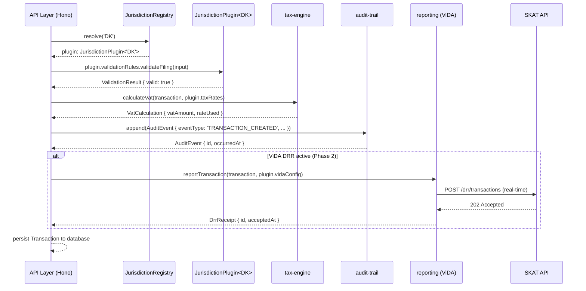

# ADR-003: Jurisdiction Plugin Architecture

## Status
Accepted

## Context
The system must support Danish VAT today (Phase 1) and additional EU jurisdictions in Phase 3 — without
modifying core packages. ViDA obligations (Phase 2) layer additional real-time reporting requirements
on top of base jurisdiction rules, and these must compose cleanly.

The key invariant: **adding a new country must require zero changes to core packages**.

This ADR defines the plugin contract, registration mechanism, resolution strategy, and ViDA composition model.

## Decision

### The `JurisdictionPlugin` Interface
Every jurisdiction must implement this interface. It is defined in `/packages/core-domain/src/types.ts`
and is the single contract that the core system depends on.

```typescript
interface JurisdictionPlugin<J extends JurisdictionCode> {
  readonly code: J;
  readonly displayName: string;
  readonly currencyCode: string;           // ISO 4217
  readonly smallestCurrencyUnit: string;   // e.g. 'øre', 'cent'

  taxRates: TaxRateRegistry<J>;
  validationRules: ValidationRuleSet<J>;
  filingSchedule: FilingScheduleProvider<J>;
  reportFormatter: ReportFormatter<J>;
  authorityClient: AuthorityApiClient<J>;
  vidaConfig: VidaConfig;                  // Phase 2 — ViDA obligations
}
```

### Plugin Registration
Plugins are registered at application startup into a `JurisdictionRegistry` singleton.
The registry is the only place that knows about specific jurisdictions — all other code depends only on the interface.

```typescript
// Registration (in /apps/api/src/registry.ts)
import { DkJurisdictionPlugin } from '@vat/core-domain/jurisdictions/dk';

const registry = new JurisdictionRegistry();
registry.register(DkJurisdictionPlugin);
// registry.register(NoJurisdictionPlugin);  // Phase 3: Norway
// registry.register(DeJurisdictionPlugin);  // Phase 3: Germany
```

### Plugin Resolution
At runtime, the correct plugin is resolved by `JurisdictionCode`. All business logic operates
on the resolved `JurisdictionPlugin` interface — never on a concrete implementation.

```typescript
const plugin = registry.resolve('DK');
const rate = plugin.taxRates.getStandardRate();        // 2500n (basis points = 25.00%)
const schedule = plugin.filingSchedule.getCadence(counterparty);
```

### Jurisdiction-Specific Validation Rules
Each plugin provides a `ValidationRuleSet` — a set of composable Zod schemas and business rule functions.

```typescript
interface ValidationRuleSet<J extends JurisdictionCode> {
  taxReturnSchema: ZodSchema<JurisdictionReturnFields[J]>;
  validateFiling(data: TaxReturnInput<J>): ValidationResult;
  validateCounterparty(c: Counterparty): ValidationResult;
  validateTaxCode(code: TaxCode, context: TransactionContext): ValidationResult;
}
```

For DK: the `taxReturnSchema` validates rubrikA/rubrikB fields (EU goods/services values) as required
by SKAT. For Norway, a different schema would validate MVA-specific fields. Core never sees these schemas.

### ViDA Layering (Phase 2)
ViDA obligations are modelled as a composable layer on top of base jurisdiction rules.
Each plugin declares its ViDA configuration:

```typescript
interface VidaConfig {
  drrEnabled: boolean;                     // Digital Reporting Requirements active?
  drrEndpoint: string | null;              // Real-time reporting endpoint
  drrTransactionTypes: EuTransactionType[]; // Which transactions trigger DRR
  extendedOssEnabled: boolean;             // Extended One Stop Shop active?
  platformDeemedSupplierEnabled: boolean;  // Platform economy rules active?
  effectiveFrom: string | null;            // ISO 8601 — when ViDA obligations begin
}
```

When `drrEnabled: true`, the `tax-engine` routes each transaction through a `VidaReporter`
(defined in `/packages/reporting`) before acknowledging it. This is transparent to jurisdiction plugins
that don't have ViDA active.

### Transaction Flow Through the Plugin System



### Adding a Second Jurisdiction (Norway Example)
To add Norway (NO), the following is required — and **nothing else**:

1. Create `/packages/core-domain/src/jurisdictions/no/index.ts`
2. Implement `JurisdictionPlugin<'NO'>` with:
   - Norwegian MVA rates (25% standard, 15% food, 12% passenger transport, 0% export)
   - Skatteetaten API client (implementing `AuthorityApiClient<'NO'>`)
   - Norwegian filing schedule (quarterly, with annual option for small businesses)
   - SAF-T NO report formatter (Norwegian SAF-T variant differs from DK)
   - `vidaConfig: { drrEnabled: false, ... }` (Norway follows EU ViDA timeline)
3. Add `'NO'` to the `JurisdictionCode` union type in `types.ts`
4. Register `NoJurisdictionPlugin` in `/apps/api/src/registry.ts`

**Zero changes to:** `tax-engine`, `audit-trail`, `invoice-validator`, API routing, database schema (core tables), or any other jurisdiction's code.

## Consequences

**Positive:**
- Jurisdiction isolation is enforced by the TypeScript type system — the compiler prevents accidental cross-jurisdiction coupling
- New jurisdictions can be developed independently by different agents/teams without merge conflicts on core packages
- ViDA obligations compose on top of any jurisdiction without modifying the plugin itself
- The registry pattern enables runtime feature flags — a jurisdiction plugin can be registered but marked inactive, enabling blue/green deployments of new jurisdiction support
- JSONB columns in PostgreSQL store `jurisdictionFields` as opaque blobs validated by the plugin's Zod schema — no core migration needed for new jurisdiction fields

**Negative:**
- The `JurisdictionCode` union type in `types.ts` must be updated when adding a new jurisdiction — this is a deliberate, minimal coupling point that serves as a registry of supported jurisdictions
- Jurisdiction plugins must be complete implementations of the interface — partial plugins (e.g. only tax rates, no filing) are not supported; use ViDA flags to gate incomplete features
- Testing a new jurisdiction requires a full plugin implementation; there is no partial/stub mode in production code (stubs are fine in tests)

## Alternatives Considered

| Option | Reason Rejected |
|---|---|
| Hardcoded jurisdiction switch/case | Violates open/closed principle; every new country requires core changes |
| Separate microservice per jurisdiction | Operational complexity multiplies; shared VAT logic is duplicated across services |
| Dynamic plugin loading (require() at runtime) | Loses TypeScript type safety; jurisdiction plugins must be type-checked at compile time |
| Inheritance (base class + override) | Plugin interface composition is more flexible and avoids inheritance pitfalls; TypeScript interfaces better model the plugin contract |
