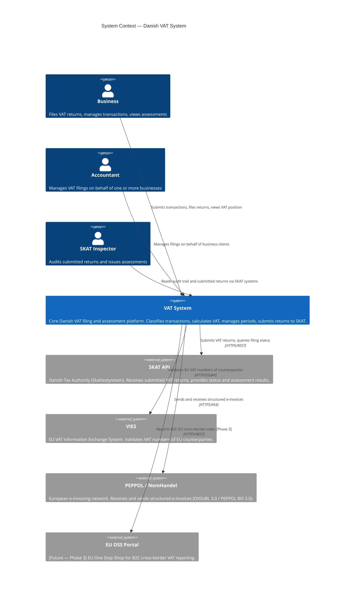

# C4 System Context — VAT System

**What this shows:** The VAT system and all external actors and systems it interacts with at the highest level of abstraction. No internal details — only boundaries and relationships.

**Last updated:** 2026-02-24
**Produced by:** Design Agent

---

---

## Notes

- The **MCP Server** (Node.js/TypeScript) is a developer/AI tooling component, not a production actor — it is excluded from this context diagram.
- **OIOUBL 2.1** is phased out May 15, 2026; the system must support OIOUBL 3.0 and PEPPOL BIS 3.0.
- **ViDA DRR** (mandatory 2028) will add a real-time reporting relationship to SKAT; the `isVidaEnabled()` flag on the `DkJurisdictionPlugin` gates this Phase 2 flow.
- **OSS Portal** is shown as future (Phase 3) — architecture is designed to accommodate it without core changes.
