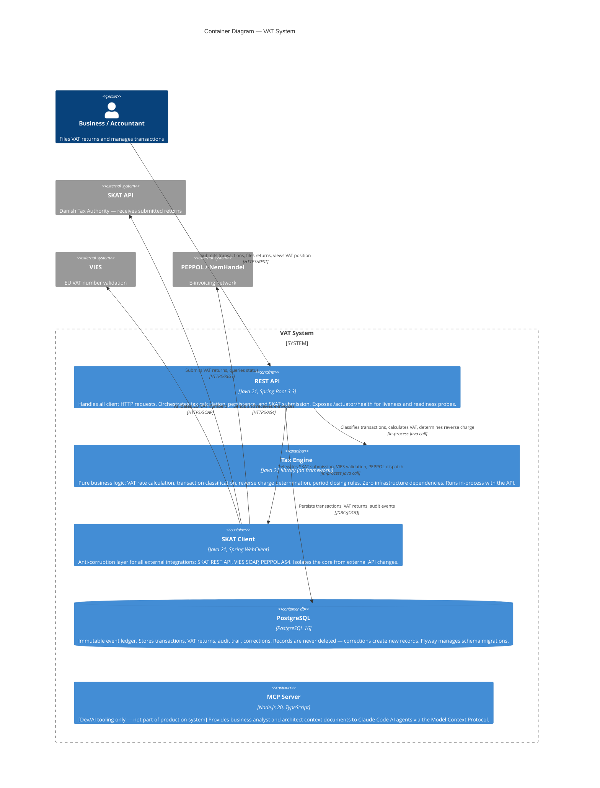

# C4 Container Diagram — VAT System

**What this shows:** All deployable containers (services, databases, libraries) inside the VAT system boundary and how they communicate. The Tax Engine is a Java library (not a separate service) — it runs in-process with the API.

**Last updated:** 2026-02-24
**Produced by:** Design Agent

---

---

## Container Responsibilities Summary

| Container | Type | Key Responsibility |
|---|---|---|
| REST API | Spring Boot app | Request handling, orchestration, Bean Validation |
| Tax Engine | Java library (in-process) | VAT calculation, classification, period rules |
| SKAT Client | Spring WebClient adapter | External API isolation (SKAT, VIES, PEPPOL) |
| PostgreSQL | Relational database | Immutable event ledger, Flyway migrations |
| MCP Server | Node.js tool (dev only) | AI agent context — not production |

## Notes

- The **Tax Engine** has **zero infrastructure dependencies** — it depends only on `core-domain`. This enables testing without a database, Spring context, or network.
- The **SKAT Client** is the sole point of contact with all external authorities — the Anti-Corruption Layer pattern.
- The **MCP Server** is excluded from all Kubernetes resource planning and production SLAs.
- All Spring Boot services expose `/actuator/health/liveness` and `/actuator/health/readiness` for Kubernetes probes.
