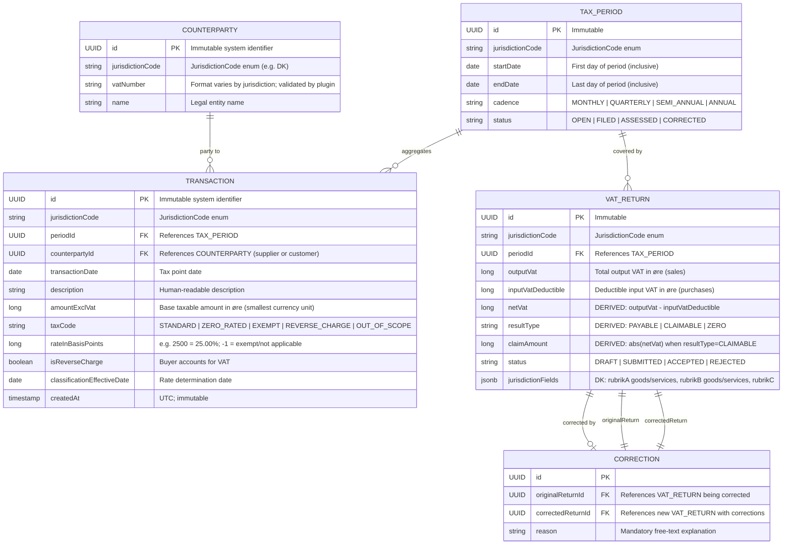

# Entity Relationship Diagram — Core Domain

**What this shows:** All core domain entities and their relationships, derived directly from the Java 21 records in `core-domain/src/main/java/com/netcompany/vat/coredomain/`. Field types reflect the Java record definitions.

**Last updated:** 2026-02-24
**Produced by:** Design Agent

> **Immutability principle:** Records are never deleted or updated in place. Corrections produce new `VatReturn` records linked by a `Correction` record. The original remains intact for audit purposes. This is mandated by Bogføringsloven (Danish Bookkeeping Act) — records must be retained for 5 years.

---

---

## Jurisdiction-Specific Fields in `jurisdictionFields` (JSONB)

The `VAT_RETURN.jurisdictionFields` column stores authority-specific fields as opaque JSONB. Core never reads or writes these directly — they are validated by the jurisdiction plugin.

**Danish (DK) fields stored in `jurisdictionFields`:**

| Field Key | Description | Source |
|---|---|---|
| `rubrikAGoodsEuPurchaseValue` | Value of EU goods purchases (acquisition VAT — Rubrik A goods) | ML §46; SKAT rubrik format |
| `rubrikAServicesEuPurchaseValue` | Value of EU/non-EU service purchases under reverse charge (Rubrik A services) | SKAT rubrik format |
| `rubrikBGoodsEuSaleValue` | Value of goods sold to EU VAT-registered businesses (Rubrik B goods) | SKAT EU-salgsangivelse |
| `rubrikBServicesEuSaleValue` | Value of services sold without DK VAT to EU B2B buyers (Rubrik B services) | SKAT rubrik format |
| `rubrikCOtherVatExemptSuppliesValue` | Other zero-rated/exempt supplies not in Rubrik B (exports, ML §13 exempt) | SKAT rubrik format |

## Value Object: `TaxClassification` (embedded in `TRANSACTION`)

The `TaxClassification` record is stored inline in `TRANSACTION` (flattened columns). It captures the VAT treatment at the moment of classification so historical records retain correct rates even if rules change.

| Field | Type | Notes |
|---|---|---|
| `taxCode` | `TaxCode` enum | VAT treatment category |
| `rateInBasisPoints` | `long` | 2500 = 25.00%; 0 = zero-rated; -1 = exempt/N/A |
| `isReverseCharge` | `boolean` | Buyer self-assesses |
| `effectiveDate` | `LocalDate` | Rate determination date |

## Error Model (not persisted — domain layer only)

`VatRuleError` is a sealed interface used with `Result<T>` to propagate validation failures without exceptions:

- `UnknownTaxCode(code)` — unrecognised tax code
- `InvalidTransaction(reason)` — transaction fails validation
- `MissingVatNumber(counterpartyId)` — reverse charge requires VAT number
- `PeriodAlreadyFiled(periodId)` — attempt to modify a filed period
