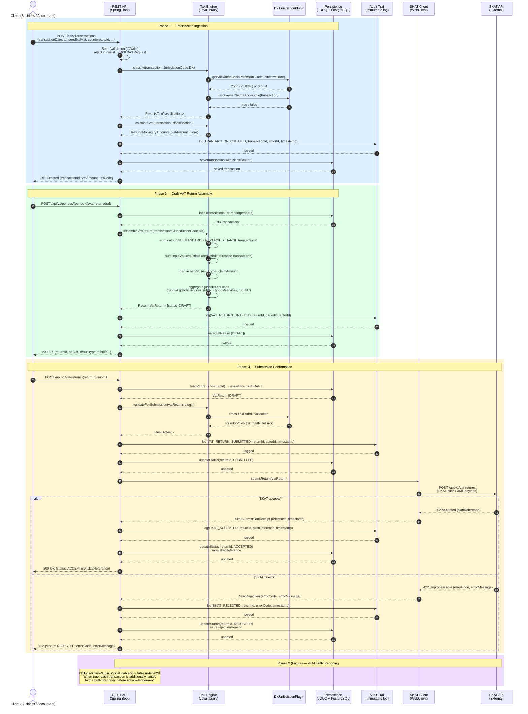

# Sequence Diagram — VAT Return Filing Flow

**What this shows:** The complete end-to-end flow of filing a Danish VAT return, from client transaction submission through SKAT acceptance. Shows all system actors and the messages between them.

**Last updated:** 2026-02-24
**Produced by:** Design Agent

---

---

## Actor Summary

| Actor | Module | Notes |
|---|---|---|
| Client | External | Business or accountant using REST API |
| REST API | `/api` | Spring Boot 3.3; Bean Validation at entry |
| Tax Engine | `/tax-engine` | Pure Java; no Spring/DB dependencies |
| DkJurisdictionPlugin | `/core-domain/dk` | Stateless; registered as Spring singleton |
| Persistence | `/persistence` | JOOQ queries; Flyway-managed schema |
| Audit Trail | `/persistence` | Append-only immutable log table |
| SKAT Client | `/skat-client` | WebClient; WireMock in tests |
| SKAT API | External | `https://api.skat.dk` (sandbox: `https://api-sandbox.skat.dk`) |

## Key Invariants

- **Audit before effect:** The audit event is always written before the state change takes effect.
- **Immutability:** Once `SUBMITTED`, a return cannot be modified — corrections require a `Correction` record linking old and new `VatReturn`.
- **Result monad:** Tax Engine returns `Result<T>` (not exceptions) for expected domain errors.
- **ViDA gate:** `DkJurisdictionPlugin.isVidaEnabled()` is `false` until Phase 2 (planned 2028).
