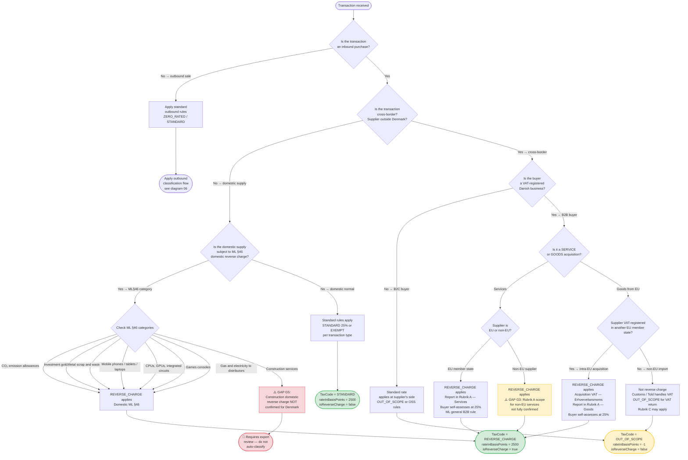

# Data Flow Diagram — Reverse Charge Decision

**What this shows:** The decision flow for determining whether reverse charge (omvendt betalingspligt) applies to a transaction. Based strictly on `docs/analysis/dk-vat-rules-validated.md` and the `DkJurisdictionPlugin` implementation.

**Last updated:** 2026-02-24
**Produced by:** Design Agent

> **Reverse charge** means the buyer (not the supplier) is responsible for accounting for VAT. The supplier invoices without Danish VAT; the Danish buyer both declares output VAT (self-assessed) and deducts it as input VAT (if deductible). Rule source: ML §46, SKAT, EU VAT Directive B2B general rule.

---

---

## Reverse Charge Output on the VAT Return

When `isReverseCharge = true`, the transaction contributes to two VAT return fields simultaneously:

| Contribution | Field | Description |
|---|---|---|
| Output VAT | `outputVat` | Buyer self-assessed VAT at 25% |
| Input VAT | `inputVatDeductible` | Recovered immediately (if deductible) |
| Rubrik A goods | `jurisdictionFields.rubrikAGoodsEuPurchaseValue` | Intra-EU goods acquisition value |
| Rubrik A services | `jurisdictionFields.rubrikAServicesEuPurchaseValue` | Cross-border service value |

## Known Gaps (from `dk-vat-rules-validated.md`)

| Gap | Description | Risk |
|---|---|---|
| G3 | Non-EU purchased services: Rubrik A reporting scope unclear | Possible misreporting |
| G5 | Construction domestic reverse charge not confirmed for Denmark | Missing classification |
