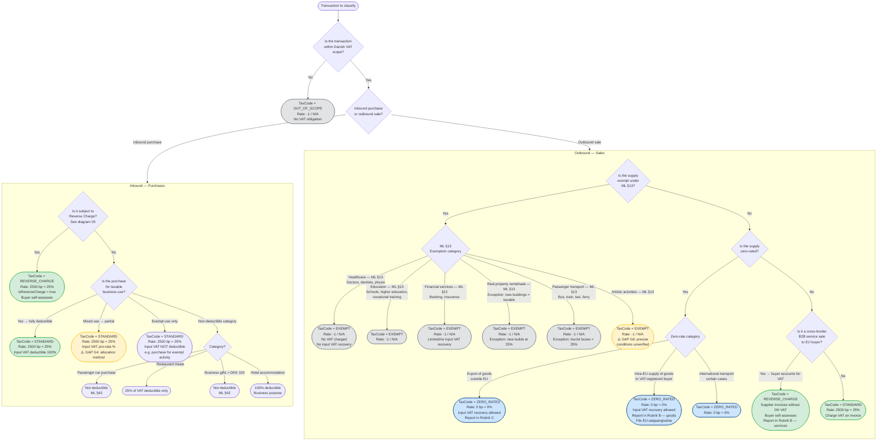

# Data Flow Diagram — VAT Classification Decision Tree

**What this shows:** The full classification decision tree for any transaction — determining which `TaxCode` applies. Based strictly on `docs/analysis/dk-vat-rules-validated.md` and the `DkJurisdictionPlugin` implementation. Gap items are marked visually.

**Last updated:** 2026-02-24
**Produced by:** Design Agent

---

---

## TaxCode Summary (from `TaxCode.java`)

| TaxCode | DK Rate (basis points) | Description |
|---|---|---|
| `STANDARD` | 2500 (25.00%) | Standard Danish MOMS |
| `ZERO_RATED` | 0 (0.00%) | Exports, intra-EU goods; input VAT recovery allowed |
| `EXEMPT` | -1 (N/A) | ML §13 exempt; no VAT charged, limited/no input VAT recovery |
| `REVERSE_CHARGE` | 2500 (25.00%) | Buyer self-assesses; -1 from supplier's perspective |
| `OUT_OF_SCOPE` | -1 (N/A) | Not subject to Danish VAT |

## Reporting Field Mapping

| TaxCode | Rubrik | Notes |
|---|---|---|
| `ZERO_RATED` (intra-EU goods) | Rubrik B — goods | Must also file EU-salgsangivelse |
| `ZERO_RATED` (exports) | Rubrik C | Non-EU exports |
| `REVERSE_CHARGE` (EU goods inbound) | Rubrik A — goods | Acquisition VAT |
| `REVERSE_CHARGE` (services inbound) | Rubrik A — services | Cross-border B2B services |
| `REVERSE_CHARGE` (services outbound) | Rubrik B — services | EU B2B service sales |
| `EXEMPT` | Rubrik C | Other exempt supplies |

## Known Gaps (from `dk-vat-rules-validated.md`)

| Gap | Description | Risk |
|---|---|---|
| G4 | Partial deduction allocation methodology (turnover vs area vs usage) | Incorrect refund/payable calculation |
| G6 | Artistic activities exemption — precise ML §13 conditions | Wrong VAT treatment for creative sector |
