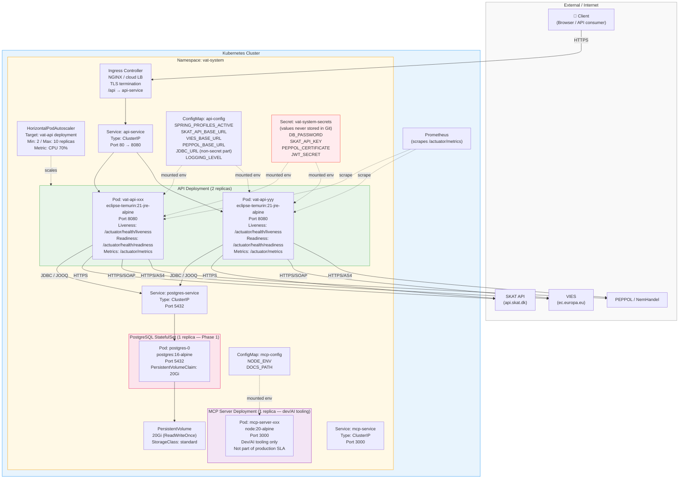

# Kubernetes Deployment Diagram

**What this shows:** The Kubernetes deployment architecture for the VAT system — namespace, workloads, services, config, secrets, and autoscaling. Reflects the manifests under `/infrastructure/k8s/`.

**Last updated:** 2026-02-24
**Produced by:** Design Agent

---

---

## Resource Limits (all pods)

| Pod | CPU Request | CPU Limit | Memory Request | Memory Limit |
|---|---|---|---|---|
| `vat-api` | 250m | 500m | 256Mi | 512Mi |
| `postgres` | 250m | 500m | 512Mi | 1Gi |
| `mcp-server` | 100m | 200m | 128Mi | 256Mi |

## Manifest Locations

| Resource | Path |
|---|---|
| Namespace | `/infrastructure/k8s/cluster/namespace.yaml` |
| Ingress | `/infrastructure/k8s/cluster/ingress.yaml` |
| Secrets template | `/infrastructure/k8s/cluster/secrets-template.yaml` |
| API deployment | `/infrastructure/k8s/api/deployment.yaml` |
| API service | `/infrastructure/k8s/api/service.yaml` |
| API configmap | `/infrastructure/k8s/api/configmap.yaml` |
| API HPA | `/infrastructure/k8s/api/hpa.yaml` |
| PostgreSQL statefulset | `/infrastructure/k8s/persistence/deployment.yaml` |
| PostgreSQL service | `/infrastructure/k8s/persistence/service.yaml` |
| MCP server deployment | `/infrastructure/k8s/mcp-server/deployment.yaml` |
| MCP server service | `/infrastructure/k8s/mcp-server/service.yaml` |
| MCP server configmap | `/infrastructure/k8s/mcp-server/configmap.yaml` |

## Notes

- **Secrets** are never committed to Git. `secrets-template.yaml` shows required keys with placeholder values only.
- **PostgreSQL** runs as a single StatefulSet replica in Phase 1. A read replica or managed cloud DB (e.g. Cloud SQL, RDS) is recommended for Phase 2+.
- **MCP Server** is for developer/AI tooling only. It is not subject to production SLAs and should not be exposed outside the cluster.
- All pods run as **non-root** users per the ROLE_CONTEXT_POLICY container requirements.
- **OpenTelemetry** collector (not shown) should be deployed as a DaemonSet in production to receive traces from all pods.
