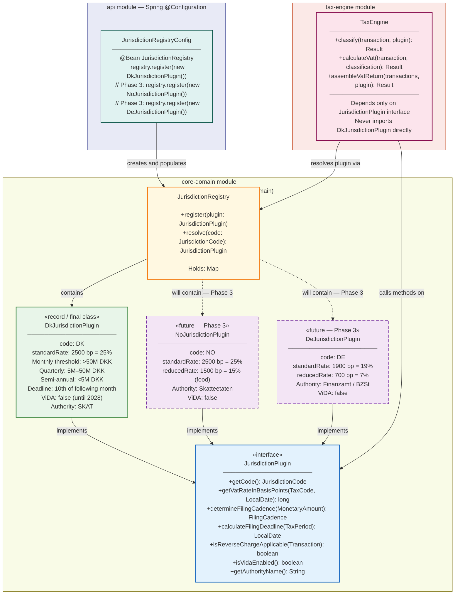
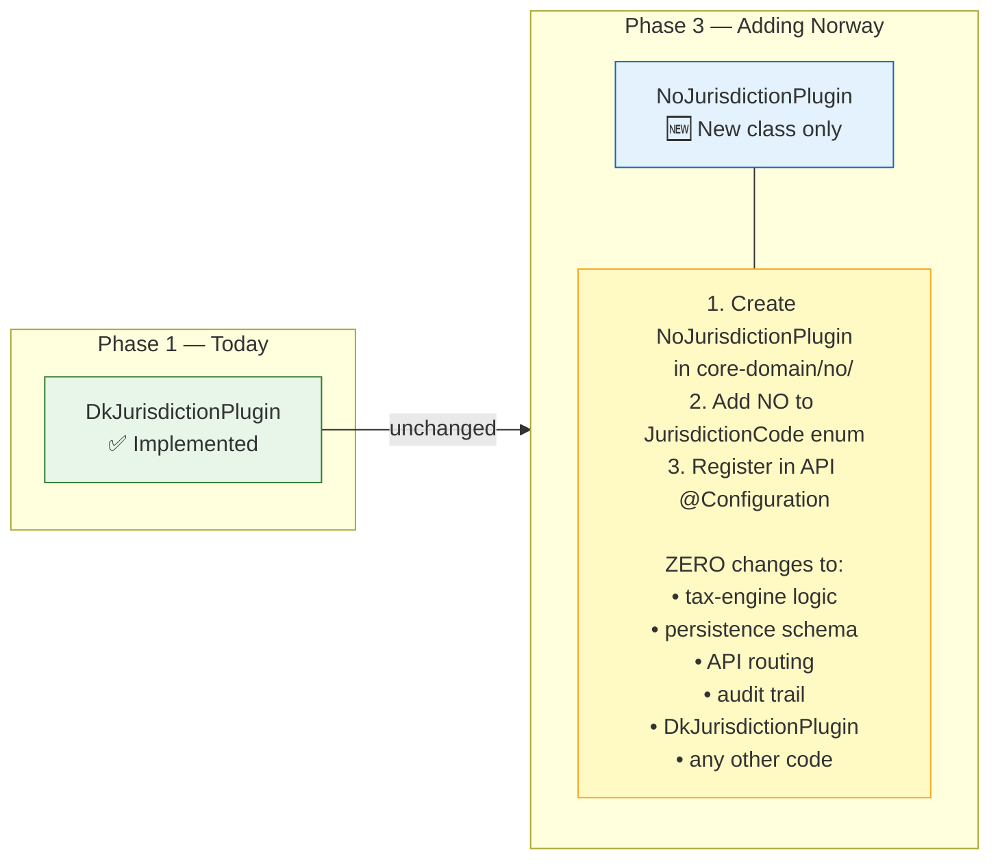

# Jurisdiction Plugin Architecture Diagram

**What this shows:** How the plugin system works — the `JurisdictionPlugin` interface, its current implementation (`DkJurisdictionPlugin`), the `JurisdictionRegistry`, and how the `TaxEngine` resolves plugins at runtime. Future jurisdiction placeholders show that adding a new country requires a new box only — zero changes to existing code.

**Last updated:** 2026-02-24
**Produced by:** Design Agent

> **Key invariant (ADR-003):** Adding a new country = new plugin class only. Zero changes to `tax-engine`, `persistence`, API routing, audit trail, or any other jurisdiction's code.

---

## Plugin System Overview



---

## Adding a New Jurisdiction — What Changes



---

## ViDA Layering (Phase 2)

```mermaid
flowchart TD
    TX["Transaction received"] --> RESOLVE["Resolve plugin\nregistry.resolve(jurisdictionCode)"]
    RESOLVE --> CLASSIFY["classify + calculateVat\nvia TaxEngine"]
    CLASSIFY --> VIDA_CHECK{plugin.isVidaEnabled()?}

    VIDA_CHECK -- false\nDK until 2028 --> PERSIST["Persist transaction\n+ audit log"]
    VIDA_CHECK -- true\nPhase 2 future --> DRR["Route to DRR Reporter\nReal-time reporting\nto tax authority API"]
    DRR --> PERSIST

    PERSIST --> ACK["Acknowledge to client"]

    style VIDA_CHECK fill:#fff3cd,stroke:#ffc107
    style DRR fill:#f3e5f5,stroke:#9C27B0,stroke-dasharray: 8 4
```

---

## Interface Contract Summary

| Method | DK Implementation | Purpose |
|---|---|---|
| `getCode()` | `JurisdictionCode.DK` | Registry lookup key |
| `getVatRateInBasisPoints(STANDARD, date)` | `2500` | 25.00% MOMS |
| `getVatRateInBasisPoints(EXEMPT, date)` | `-1` | Not applicable |
| `determineFilingCadence(>50M DKK)` | `MONTHLY` | High-turnover filers |
| `determineFilingCadence(5M–50M DKK)` | `QUARTERLY` | Mid-range filers |
| `determineFilingCadence(<5M DKK)` | `SEMI_ANNUAL` | Small filers |
| `calculateFilingDeadline(period)` | `period.endDate + 1 month, 10th` | 10th of following month |
| `isReverseChargeApplicable(tx)` | `tx.classification.taxCode == REVERSE_CHARGE` | Delegate to classification |
| `isVidaEnabled()` | `false` | Phase 2 gate |
| `getAuthorityName()` | `"SKAT"` | Audit log header |
