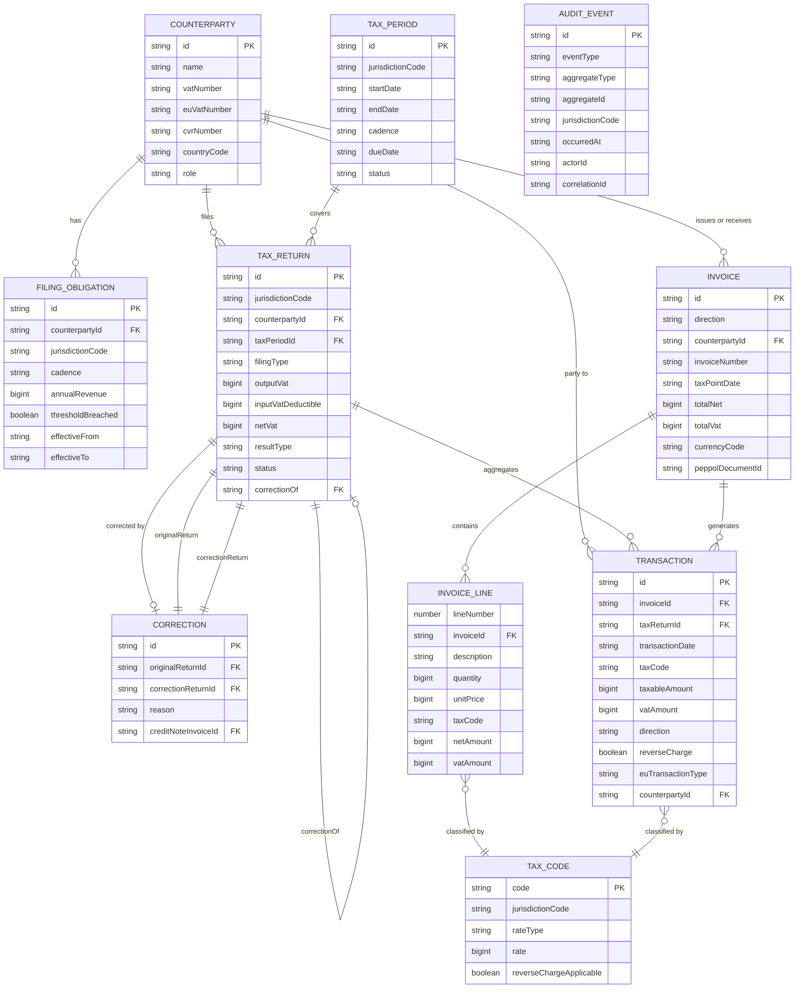

# Core Domain Model — VAT System

## Overview

The domain model is **jurisdiction-agnostic at its core**. All entities use generics or union types
to support jurisdiction-specific extensions without polluting core logic. The Danish (`DK`) plugin
is the first concrete implementation; additional jurisdictions extend the same interfaces.

---

## Entity Catalogue

### 1. `TaxReturn<J>`
The top-level aggregate for a single VAT filing period for one registered entity in one jurisdiction.

| Field | Type | Jurisdiction-neutral? | Notes |
|---|---|---|---|
| `id` | `string` (UUID) | Yes | Immutable system identifier |
| `jurisdiction` | `J extends JurisdictionCode` | Yes | e.g. `'DK'`, `'NO'` |
| `counterpartyId` | `string` | Yes | FK to `Counterparty` |
| `taxPeriod` | `TaxPeriod` | Yes | Start/end dates of the filing period |
| `filingType` | `FilingType` | Yes | `'regular' \| 'correction' \| 'nil'` |
| `outputVat` | `bigint` | Yes | Total output VAT (øre/smallest unit) |
| `inputVatDeductible` | `bigint` | Yes | Deductible input VAT |
| `netVat` | `bigint` | Yes | Derived: outputVat − inputVatDeductible |
| `resultType` | `'payable' \| 'claimable'` | Yes | Derived from netVat sign |
| `status` | `ReturnStatus` | Yes | `'draft' \| 'submitted' \| 'accepted' \| 'rejected'` |
| `submittedAt` | `string \| null` | Yes | ISO 8601 UTC |
| `jurisdictionFields` | `JurisdictionReturnFields[J]` | **No** | Authority-specific rubrik data, etc. |
| `correctionOf` | `string \| null` | Yes | FK to original `TaxReturn.id` if correction |
| `createdAt` | `string` | Yes | ISO 8601 UTC, immutable |

---

### 2. `Invoice`
A legal document representing a supply of goods or services. May be inbound (purchase) or outbound (sale).

| Field | Type | Jurisdiction-neutral? | Notes |
|---|---|---|---|
| `id` | `string` | Yes | Immutable |
| `direction` | `'inbound' \| 'outbound'` | Yes | |
| `counterpartyId` | `string` | Yes | Supplier or customer |
| `invoiceNumber` | `string` | Yes | |
| `invoiceDate` | `string` | Yes | ISO 8601 |
| `taxPointDate` | `string` | Yes | VAT liability date (may differ from invoice date) |
| `lines` | `InvoiceLine[]` | Yes | |
| `totalNet` | `bigint` | Yes | Excl. VAT |
| `totalVat` | `bigint` | Yes | |
| `totalGross` | `bigint` | Yes | |
| `currencyCode` | `string` | Yes | ISO 4217 (e.g. `'DKK'`) |
| `peppolDocumentId` | `string \| null` | Yes | PEPPOL BIS 3.0 ref if e-invoice |
| `jurisdictionCode` | `JurisdictionCode` | Yes | Which jurisdiction's rules apply |

---

### 3. `InvoiceLine`
A single line item on an invoice.

| Field | Type | Notes |
|---|---|---|
| `lineNumber` | `number` | 1-based |
| `description` | `string` | |
| `quantity` | `bigint` | In smallest unit (e.g. 1000 = 1.000 units) |
| `unitPrice` | `bigint` | Per unit, excl. VAT, in smallest currency unit |
| `taxCode` | `TaxCode` | Determines rate and treatment |
| `netAmount` | `bigint` | quantity × unitPrice |
| `vatAmount` | `bigint` | Calculated from taxCode rate |

---

### 4. `Transaction`
Records an economic event that affects VAT position. Each `Invoice` generates one or more `Transactions`.

| Field | Type | Jurisdiction-neutral? | Notes |
|---|---|---|---|
| `id` | `string` | Yes | Immutable |
| `invoiceId` | `string` | Yes | Source invoice |
| `taxReturnId` | `string \| null` | Yes | Assigned when period is closed |
| `transactionDate` | `string` | Yes | ISO 8601 |
| `taxCode` | `TaxCode` | Yes | |
| `taxableAmount` | `bigint` | Yes | Base amount |
| `vatAmount` | `bigint` | Yes | Computed |
| `direction` | `'input' \| 'output'` | Yes | |
| `reverseCharge` | `boolean` | Yes | |
| `euTransactionType` | `EuTransactionType \| null` | Yes | `'goods' \| 'services' \| null` |
| `counterpartyId` | `string` | Yes | |

---

### 5. `TaxCode`
Encodes the VAT treatment for a line item. Jurisdiction-neutral enum values backed by jurisdiction-specific rate data.

| Field | Type | Notes |
|---|---|---|
| `code` | `string` | e.g. `'DK_STANDARD'`, `'DK_ZERO'`, `'DK_EXEMPT'` |
| `jurisdictionCode` | `JurisdictionCode` | |
| `rateType` | `'standard' \| 'reduced' \| 'zero' \| 'exempt'` | |
| `rate` | `bigint` | Basis points (e.g. 2500 = 25.00%) |
| `reverseChargeApplicable` | `boolean` | |
| `description` | `string` | Human-readable |

---

### 6. `TaxPeriod`
Represents the time window for a VAT filing.

| Field | Type | Notes |
|---|---|---|
| `id` | `string` | |
| `jurisdictionCode` | `JurisdictionCode` | |
| `startDate` | `string` | ISO 8601, inclusive |
| `endDate` | `string` | ISO 8601, inclusive |
| `cadence` | `'monthly' \| 'quarterly' \| 'annual'` | |
| `dueDate` | `string` | Filing deadline, ISO 8601 |
| `periodDays` | `number` | Derived: endDate − startDate + 1 |
| `status` | `'open' \| 'closed' \| 'submitted'` | |

---

### 7. `Counterparty`
A legal entity — either the taxpayer themselves, a customer, or a supplier.

| Field | Type | Notes |
|---|---|---|
| `id` | `string` | |
| `name` | `string` | |
| `role` | `'self' \| 'customer' \| 'supplier'` | |
| `vatNumber` | `string \| null` | Format validated per jurisdiction |
| `euVatNumber` | `string \| null` | VIES-validated EU VAT number |
| `cvrNumber` | `string \| null` | Danish CVR (DK-specific) |
| `countryCode` | `string` | ISO 3166-1 alpha-2 |
| `address` | `Address` | |
| `viesValidated` | `boolean` | |
| `viesValidatedAt` | `string \| null` | ISO 8601 |

---

### 8. `FilingObligation`
Describes the legal obligation for a counterparty to file in a jurisdiction.

| Field | Type | Notes |
|---|---|---|
| `id` | `string` | |
| `counterpartyId` | `string` | |
| `jurisdictionCode` | `JurisdictionCode` | |
| `cadence` | `'monthly' \| 'quarterly' \| 'annual'` | Determined by revenue thresholds |
| `annualRevenue` | `bigint` | Used to determine cadence |
| `thresholdBreached` | `boolean` | e.g. >50M DKK triggers monthly in DK |
| `effectiveFrom` | `string` | ISO 8601 |
| `effectiveTo` | `string \| null` | Null = currently active |

---

### 9. `Correction`
Represents a formal correction to a previously submitted `TaxReturn`. Corrections are new events — the original is never mutated.

| Field | Type | Notes |
|---|---|---|
| `id` | `string` | |
| `originalReturnId` | `string` | FK to the return being corrected |
| `correctionReturnId` | `string` | FK to the new return with corrections |
| `reason` | `string` | Mandatory free-text |
| `creditNoteInvoiceId` | `string \| null` | If triggered by a credit note |
| `createdAt` | `string` | ISO 8601, immutable |
| `createdBy` | `string` | User or system identifier |

---

### 10. `AuditEvent`
Immutable log of every state change. Written before the state change takes effect.

| Field | Type | Notes |
|---|---|---|
| `id` | `string` | UUID, immutable |
| `eventType` | `AuditEventType` | e.g. `'RETURN_SUBMITTED'`, `'INVOICE_CREATED'` |
| `aggregateType` | `string` | e.g. `'TaxReturn'`, `'Invoice'` |
| `aggregateId` | `string` | FK to the affected entity |
| `payload` | `Record<string, unknown>` | Snapshot of relevant state |
| `jurisdictionCode` | `JurisdictionCode` | |
| `occurredAt` | `string` | ISO 8601 UTC, system clock |
| `actorId` | `string` | User or agent identifier |
| `correlationId` | `string` | Links related events (e.g. correction chain) |

---

## Entity Relationships

---

## Jurisdiction-Neutral vs Jurisdiction-Specific Fields

| Concept | Neutral Core | DK-Specific Extension |
|---|---|---|
| Tax return fields | outputVat, inputVat, netVat, status | rubrikA (goods/services), rubrikB (goods/services) |
| Counterparty ID | vatNumber, euVatNumber | cvrNumber (8-digit CVR) |
| Filing cadence | monthly/quarterly/annual | Threshold: >50M DKK → monthly |
| Tax code | rateType (standard/reduced/zero/exempt) | `DK_STANDARD` (25%), `DK_ZERO`, `DK_EXEMPT` |
| Report format | Structured filing data | SKAT XML rubrik format |
| Authority client | `AuthorityApiClient` interface | SKAT REST API client |
