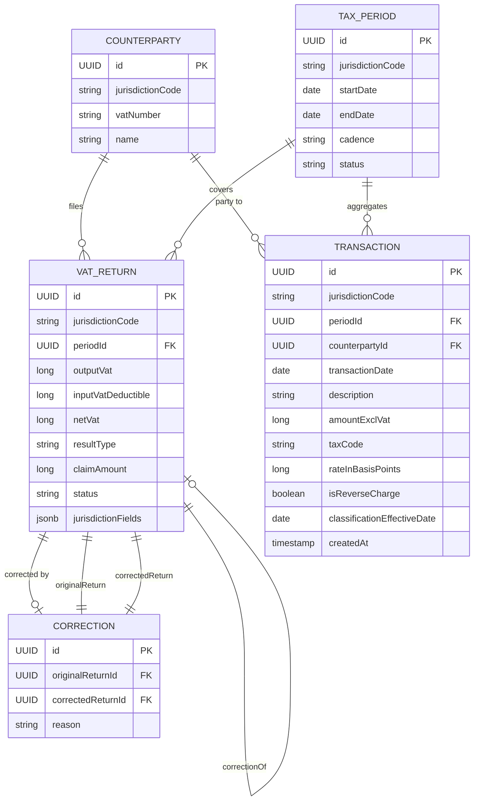

# Core Domain Model — VAT System

## Overview

The domain model is **jurisdiction-agnostic at its core**. All entities are Java 21 records or sealed
interfaces with no framework dependencies. Danish VAT is the first jurisdiction plugin; additional
countries extend the same interfaces without touching core logic.

Base package: `com.netcompany.vat.domain`

---

## Value Objects

### `MonetaryAmount` (record)

Wraps a `long` representing the smallest currency unit (øre for DKK). Never use `double` or
`BigDecimal` for monetary storage.

```java
public record MonetaryAmount(long oere) {
    public static MonetaryAmount ofOere(long oere) { ... }
    public static MonetaryAmount zero() { ... }
    public MonetaryAmount add(MonetaryAmount other) { ... }
    public MonetaryAmount subtract(MonetaryAmount other) { ... }
    public MonetaryAmount negate() { ... }
}
```

---

## Enumerations

### `JurisdictionCode`
```java
public enum JurisdictionCode { DK }
```
The deliberate, minimal coupling point when adding a new jurisdiction. Update this enum and create
a new plugin implementation — zero other core changes required.

### `TaxCode`
```java
public enum TaxCode { STANDARD, ZERO_RATED, EXEMPT, REVERSE_CHARGE, OUT_OF_SCOPE }
```

### `FilingCadence`
```java
public enum FilingCadence { MONTHLY, QUARTERLY, SEMI_ANNUAL, ANNUAL }
```
`SEMI_ANNUAL` covers DK businesses with annual turnover < 5M DKK (added following BA validation).

### `TaxPeriodStatus`
```java
public enum TaxPeriodStatus { OPEN, FILED, ASSESSED, CORRECTED }
```

### `VatReturnStatus`
```java
public enum VatReturnStatus { DRAFT, SUBMITTED, ACCEPTED, REJECTED }
```

### `ResultType`
```java
public enum ResultType { PAYABLE, CLAIMABLE, ZERO }
```
Derived from `netVat`: positive → PAYABLE, negative → CLAIMABLE, zero → ZERO.

---

## Entity Catalogue

### 1. `TaxClassification` (record)

The VAT treatment applied to a transaction line. Stored immutably at transaction time so that
historical records retain their rate even if the jurisdiction changes it later.

| Field | Type | Notes |
|---|---|---|
| `taxCode` | `TaxCode` | Jurisdiction-neutral treatment |
| `rateInBasisPoints` | `long` | e.g. 2500 = 25.00%; -1 = exempt (N/A) |
| `isReverseCharge` | `boolean` | Buyer accounts for VAT |
| `effectiveDate` | `LocalDate` | Rate determination date |

---

### 2. `Transaction` (record)

An economic event that affects VAT position within a period. Immutable — corrections create new
transactions, never modify existing ones.

| Field | Type | Jurisdiction-neutral? | Notes |
|---|---|---|---|
| `id` | `UUID` | Yes | Immutable system identifier |
| `jurisdictionCode` | `JurisdictionCode` | Yes | Governing jurisdiction |
| `periodId` | `UUID` | Yes | FK to `TaxPeriod` |
| `counterpartyId` | `UUID` | Yes | Supplier or customer |
| `transactionDate` | `LocalDate` | Yes | Tax point date |
| `description` | `String` | Yes | Human-readable |
| `amountExclVat` | `MonetaryAmount` | Yes | Base taxable amount in øre |
| `classification` | `TaxClassification` | Yes | VAT treatment applied |
| `createdAt` | `Instant` | Yes | UTC, immutable |

Computed method: `vatAmount()` — applies the basis-point rate to `amountExclVat` using exact
integer arithmetic.

---

### 3. `TaxPeriod` (record)

The time window for a VAT filing. Cadence and deadlines are determined by the jurisdiction plugin.

| Field | Type | Notes |
|---|---|---|
| `id` | `UUID` | Immutable |
| `jurisdictionCode` | `JurisdictionCode` | |
| `startDate` | `LocalDate` | First day of period (inclusive) |
| `endDate` | `LocalDate` | Last day of period (inclusive) |
| `cadence` | `FilingCadence` | MONTHLY / QUARTERLY / SEMI_ANNUAL / ANNUAL |
| `status` | `TaxPeriodStatus` | OPEN / FILED / ASSESSED / CORRECTED |

Computed method: `periodDays()` — derived, not stored (endDate − startDate + 1).

---

### 4. `Counterparty` (record)

A legal entity — taxpayer, customer, or supplier. VAT number format is validated per jurisdiction
by the plugin; the core stores it as a raw string.

| Field | Type | Notes |
|---|---|---|
| `id` | `UUID` | |
| `jurisdictionCode` | `JurisdictionCode` | Jurisdiction of registration |
| `vatNumber` | `String` | Format varies by jurisdiction |
| `name` | `String` | Legal name |

---

### 5. `VatReturn` (record)

Top-level aggregate for a single VAT filing period. Immutable — corrections produce a new
`VatReturn` linked via a `Correction` record.

| Field | Type | Jurisdiction-neutral? | Notes |
|---|---|---|---|
| `id` | `UUID` | Yes | Immutable |
| `jurisdictionCode` | `JurisdictionCode` | Yes | |
| `periodId` | `UUID` | Yes | FK to `TaxPeriod` |
| `outputVat` | `MonetaryAmount` | Yes | Total output VAT (sales) |
| `inputVatDeductible` | `MonetaryAmount` | Yes | Deductible input VAT (purchases) |
| `netVat` | `MonetaryAmount` | Yes | Derived: outputVat − inputVatDeductible |
| `resultType` | `ResultType` | Yes | Derived from netVat sign |
| `claimAmount` | `MonetaryAmount` | Yes | Derived: abs(netVat) when CLAIMABLE |
| `status` | `VatReturnStatus` | Yes | Lifecycle state |
| `jurisdictionFields` | `Map<String, Object>` | **No** | Authority-specific fields (e.g. SKAT rubrik values) |

Use the `VatReturn.of(...)` factory to create instances — it derives `netVat`, `resultType`,
and `claimAmount` automatically.

---

### 6. `Correction` (record)

Formal correction to a previously submitted `VatReturn`. The original is never modified.

| Field | Type | Notes |
|---|---|---|
| `id` | `UUID` | |
| `originalReturnId` | `UUID` | The return being corrected |
| `correctedReturnId` | `UUID` | The new return with corrections |
| `reason` | `String` | Mandatory free-text |

---

## Error Model

### `VatRuleError` (sealed interface)

Discriminated union of domain-level VAT rule violations. Used with `Result<T>` to propagate
errors without exceptions.

```java
public sealed interface VatRuleError
        permits UnknownTaxCode, InvalidTransaction, MissingVatNumber, PeriodAlreadyFiled {

    record UnknownTaxCode(String code) implements VatRuleError {}
    record InvalidTransaction(String reason) implements VatRuleError {}
    record MissingVatNumber(String counterpartyId) implements VatRuleError {}
    record PeriodAlreadyFiled(UUID periodId) implements VatRuleError {}
}
```

### `Result<T>` (sealed interface)

Functional error monad. Use instead of exceptions for expected domain rule violations.

```java
public sealed interface Result<T> permits Result.Ok, Result.Err {
    record Ok<T>(T value) implements Result<T> {}
    record Err<T>(VatRuleError error) implements Result<T> {}

    static <T> Result<T> ok(T value) { ... }
    static <T> Result<T> err(VatRuleError error) { ... }
    boolean isOk();
    boolean isErr();
    <U> Result<U> map(Function<T, U> mapper);
    <U> Result<U> flatMap(Function<T, Result<U>> mapper);
}
```

---

## Jurisdiction Plugin Interface

### `JurisdictionPlugin` (interface)

Defined in `com.netcompany.vat.domain.jurisdiction`. Every country implements this interface.

```java
public interface JurisdictionPlugin {
    JurisdictionCode getCode();
    long getVatRateInBasisPoints(TaxCode taxCode, LocalDate effectiveDate);
    FilingCadence determineFilingCadence(MonetaryAmount annualTurnover);
    LocalDate calculateFilingDeadline(TaxPeriod period);
    boolean isReverseChargeApplicable(Transaction transaction);
    boolean isVidaEnabled();
    String getAuthorityName();
}
```

---

## Entity Relationships



---

## Jurisdiction-Neutral vs Jurisdiction-Specific Fields

| Concept | Neutral Core | DK Extension (via `jurisdictionFields`) |
|---|---|---|
| Tax return fields | `outputVat`, `inputVat`, `netVat`, `status` | `rubrikA` (EU goods/services), `rubrikB` (EU goods/services) |
| Counterparty ID | `vatNumber` | CVR number (8-digit, stored separately in persistence) |
| Filing cadence | MONTHLY / QUARTERLY / SEMI_ANNUAL / ANNUAL | Threshold: >50M DKK → monthly; <5M DKK → semi-annual |
| Tax code | `STANDARD`, `ZERO_RATED`, `EXEMPT`, etc. | Rate: 25% standard, 0% zero/export |
| Report format | Structured filing data | SKAT XML rubrik format |
| Authority client | `JurisdictionPlugin.getAuthorityName()` | SKAT REST API client |
